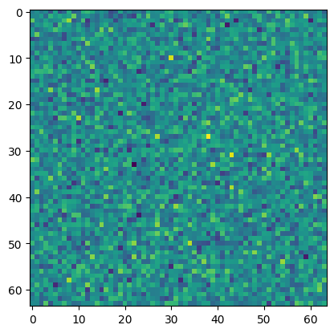

``` python
import numpy as np
import matplotlib.pyplot as plt

plt.imshow(np.random.normal(0,1,(64,64)))
```

    <matplotlib.image.AxesImage>



<!-- WARNING: THIS FILE WAS AUTOGENERATED! DO NOT EDIT! -->
